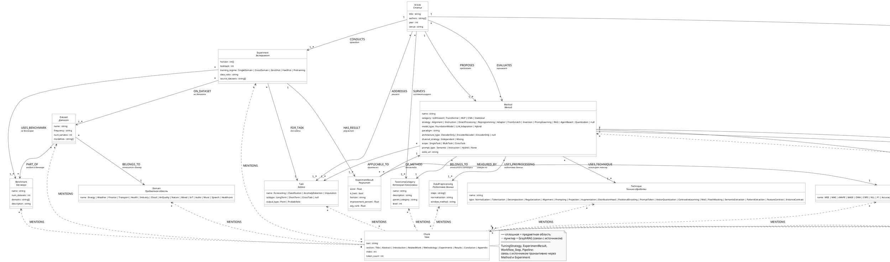

```plantuml
@startuml
skinparam monochrome true
skinparam shadowing false
skinparam roundcorner 0
skinparam classBackgroundColor white
skinparam classBorderColor #555
skinparam classFontSize 13
skinparam classAttributeFontSize 10
skinparam arrowColor #555
skinparam arrowThickness 1
skinparam defaultTextAlignment left
skinparam padding 3
skinparam nodesep 45
skinparam ranksep 45
hide circle

top to bottom direction

' ============================================================
'  СЛОЙ 1 — ИСТОЧНИК
' ============================================================

class "Article\n<size:10><i>Статья</i></size>" as Article {
  title : string
  authors : string[]
  year : int
  venue : string
}

' ============================================================
'  СЛОЙ 2 — ПРЕДМЕТНАЯ ОБЛАСТЬ
' ============================================================

together {
  class "Method\n<size:10><i>Метод</i></size>" as Method {
    name : string
    category : LLM-based | Transformer | MLP | CNN | Statistical
    strategy : Alignment | Instruction | DirectProcessing | Reprogramming | Adapter | FromScratch | Inversion | PromptLearning | RAG | AgentBased | Quantization | null
    model_type : FoundationModel | LLM_Adaptation | Hybrid
    paradigm : string
    architecture_type : DecoderOnly | EncoderDecoder | EncoderOnly | null
    channel_strategy : Independent | Mixing
    scope : SingleTask | MultiTask | CrossTask
    prompt_type : Semantic | Instruction | Hybrid | None
    code_url : string
  }

  class "Task\n<size:10><i>Задача</i></size>" as Task {
    name : Forecasting | Classification | AnomalyDetection | Imputation
    subtype : LongTerm | ShortTerm | CrossTask | null
    output_type : Point | Probabilistic
  }

  class "Experiment\n<size:10><i>Эксперимент</i></size>" as Exp {
    horizon : int[]
    lookback : int
    training_regime : SingleDomain | CrossDomain | ZeroShot | FewShot | Pretraining
    data_ratio : string
    source_datasets : string[]
  }

  class "Pipeline\n<size:10><i>Пайплайн</i></size>" as Pipeline {
    name : string
    num_steps : int
    pipeline_type : generic | method_specific
  }

  class "Workflow_Step\n<size:10><i>Шаг пайплайна</i></size>" as Step {
    step_number : int
    step_name : string
    description : string
  }
}

together {
  class "Architecture\n<size:10><i>Архитектура / Backbone</i></size>" as Arch {
    name : string
    architecture_type : DecoderOnly | EncoderDecoder | EncoderOnly | MLP | CNN | Statistical | Hybrid
    is_pretrained_llm : bool
    llm_name : string
    params : string
    num_layers : int
  }

  class "TuningStrategy\n<size:10><i>Стратегия дообучения</i></size>" as Tuning {
    approach : Frozen | PEFT | FullFT | FPT | FromScratch | EmbeddingInjection
    peft_method : LoRA | QLoRA | rsLoRA | Prefix | Adapter | PartialFT | None
    trainable_components : string[]
    frozen_components : string[]
    trainable_params : string
    memory_footprint : string
  }

  class "Technique\n<size:10><i>Техника обработки</i></size>" as Technique {
    name : string
    type : Normalization | Tokenization | Decomposition | Regularization | Alignment | Prompting | Projection | Augmentation | DistributionHead | PositionalEncoding | PromptToken | VectorQuantization | ContrastiveLearning | MoE | PatchMasking | SemanticExtraction | PatternExtraction | FeatureContrast | InstanceContrast
  }

  class "DataPreprocessing\n<size:10><i>Подготовка данных</i></size>" as DataPrep {
    steps : string[]
    normalization : string
    window_method : string
  }
}

together {
  class "Dataset\n<size:10><i>Датасет</i></size>" as Dataset {
    name : string
    frequency : string
    num_variates : int
    modalities : string[]
  }

  class "Domain\n<size:10><i>Предметная область</i></size>" as Domain {
    name : Energy | Weather | Finance | Transport | Health | Industry | Cloud | AirQuality | Nature | Mixed | IoT | Audio | Music | Speech | Healthcare
  }

  class "Benchmark\n<size:10><i>Бенчмарк</i></size>" as Benchmark {
    name : string
    num_datasets : int
    domains : string[]
    description : string
  }

  class "Metric\n<size:10><i>Метрика</i></size>" as Metric {
    name : MSE | MAE | sMAPE | MASE | OWA | CRPS | NLL | F1 | Accuracy | Precision | Recall | BLEU | ROUGE | METEOR | EM | ScaledMAE | msMAPE | MSAE | AverageRank | EffMSE
  }

  class "ExperimentResult\n<size:10><i>Результат</i></size>" as Result {
    score : float
    is_best : bool
    horizon : string
    improvement_percent : float
    avg_rank : float
  }
}

class "TaxonomyCategory\n<size:10><i>Категория таксономии</i></size>" as Taxonomy {
  name : string
  description : string
  parent_category : string
  level : int
}

' ============================================================
'  СЛОЙ 3 — GraphRAG (привязка к источнику)
' ============================================================

class "Chunk\n<size:10><i>Чанк</i></size>" as Chunk {
  text : string
  section : Title | Abstract | Introduction | RelatedWork | Methodology | Experiments | Results | Conclusion | Appendix
  index : int
  token_count : int
}

' ============================================================
'  СВЯЗИ ПРЕДМЕТНОЙ ОБЛАСТИ (сплошные линии ───)
' ============================================================

Article "1" -d-> "1..*" Method : PROPOSES\n<i><size:9>предлагает</size></i>
Article "*" -d-> "*" Method : EVALUATES\n<i><size:9>оценивает</size></i>
Article "*" -d-> "1..*" Taxonomy : SURVEYS\n<i><size:9>систематизирует</size></i>
Article "*" -d-> "1..*" Task : ADDRESSES\n<i><size:9>решает</size></i>
Article "1" -d-> "1..*" Exp : CONDUCTS\n<i><size:9>проводит</size></i>

Method "*" -d-> "0..1" Arch : HAS_ARCHITECTURE\n<i><size:9>архитектура</size></i>
Method "1" -d-> "0..1" Tuning : HAS_TUNING\n<i><size:9>стратегия дообучения</size></i>
Method "*" -d-> "1..*" Technique : USES_TECHNIQUE\n<i><size:9>использует технику</size></i>
Method "1" -d-> "0..1" Pipeline : HAS_PIPELINE\n<i><size:9>пайплайн</size></i>
Method "*" -d-> "1..*" DataPrep : USES_PREPROCESSING\n<i><size:9>подготовка данных</size></i>
Method "*" -d-> "1..*" Task : APPLICABLE_TO\n<i><size:9>применим к</size></i>
Method "*" -d-> "1" Taxonomy : BELONGS_TO\n<i><size:9>относится к категории</size></i>

Pipeline "1" -d-> "1..*" Step : CONTAINS\n<i><size:9>содержит шаги</size></i>

Exp "*" -d-> "1" Task : FOR_TASK\n<i><size:9>для задачи</size></i>
Exp "*" -d-> "1..*" Dataset : ON_DATASET\n<i><size:9>на датасете</size></i>
Exp "*" -d-> "1..*" Benchmark : USES_BENCHMARK\n<i><size:9>на бенчмарке</size></i>
Exp "1" -d-> "1..*" Result : HAS_RESULT\n<i><size:9>результат</size></i>

Result "*" -r-> "1" Metric : MEASURED_BY\n<i><size:9>измерен по</size></i>
Result "*" -u-> "1" Method : OF_METHOD\n<i><size:9>для метода</size></i>

Dataset "*" -d-> "1" Domain : BELONGS_TO\n<i><size:9>относится к домену</size></i>
Dataset "*" -d-> "*" Benchmark : PART_OF\n<i><size:9>входит в бенчмарк</size></i>

' ============================================================
'  СВЯЗИ GraphRAG (пунктирные линии ···)
' ============================================================

Article "1" -d-> "1..*" Chunk : CONTAINS\n<i><size:9>содержит</size></i>

Chunk "*" ..u> "*" Method : MENTIONS
Chunk "*" ..u> "*" Task : MENTIONS
Chunk "*" ..u> "*" Exp : MENTIONS
Chunk "*" ..u> "*" Arch : MENTIONS
Chunk "*" ..u> "*" Technique : MENTIONS
Chunk "*" ..u> "*" DataPrep : MENTIONS
Chunk "*" ..u> "*" Dataset : MENTIONS
Chunk "*" ..u> "*" Benchmark : MENTIONS
Chunk "*" ..u> "*" Metric : MENTIONS
Chunk "*" ..u> "*" Domain : MENTIONS
Chunk "*" ..u> "*" Taxonomy : MENTIONS

note right of Chunk
  ── сплошная = предметная область
  ··· пунктир = GraphRAG (связи с источником)
  ─────────────────────────────
  TuningStrategy, ExperimentResult,
  Workflow_Step, Pipeline:
  связь с источником транзитивно через
  Method и Experiment
end note

@enduml
```
